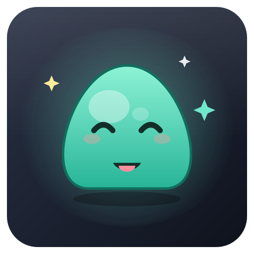

<p align="center">
  
</p>

<h1 align="center">IDE Desktop Pet Sprite</h1>

<p align="center">
  <strong>A desktop floating pet that reacts to your IDE's state</strong><br>
  Gradle sync / indexing / build·compile / run·debug — each state has its own animation and expression
</p>

<p align="center">
  <a href="docs/README.zh-CN.md">中文</a> · <strong>English</strong>
</p>

<p align="center">
  <a href="https://github.com/anjiemo/IdeDesktopPetSprite/releases/latest"></a>
  <a href="LICENSE"></a>
  <a href="https://github.com/anjiemo/IdeDesktopPetSprite/releases"></a>
  <a href="https://github.com/anjiemo/IdeDesktopPetSprite/stargazers"></a>
</p>

An Android Studio / IntelliJ plugin: across **Gradle sync, build/compile, run/debug** and other states, it shows a desktop floating pet that changes with the state and gives an expression on success / failure. The sprite is replaceable (a built-in original slime "Gel" by default).

## State mapping

| IDE event | Listener | Pet state | Sprite row |
|---|---|---|---|
| Gradle sync | `ExternalSystemTaskNotificationListener` (RESOLVE_PROJECT) | Thinking | row 4 |
| Indexing | `DumbService.DUMB_MODE` (enter / exit dumb mode) | Looking around | row 1 |
| Build / compile | `ProjectTaskListener` + Gradle EXECUTE_TASK | Running | row 2 |
| Run / debug | `ExecutionListener` | Running (faster) | row 2 |
| Success | the end callbacks above | Jumping (back to idle after 2.6s) | row 5 |
| Failure / error | the end callbacks above | Dejected (back to idle after 2.6s) | row 3 |
| Idle | —— | Idle | row 0 |

> When multiple activities overlap, the highest priority is shown: **run > build > sync > index > idle**.
> Indexing is frequent, so it does not pop a "Done" on finish — it silently returns to the current state.

## Interaction

- Drag with the left mouse button; position is remembered automatically (multi-monitor safe, snaps back to a corner if off-screen).
- Right-click menu: reset position / resize (S · M · L) / **switch character · restore default character** / temporarily hide (restored on reopening the project) / permanently close (re-enable in Settings).
- Always-on-top, transparent background, never steals editor focus.

## Build & install

> Requires JDK 17 locally. If `JAVA_HOME` doesn't point to 17, set it first; the wrapper is pinned to Gradle 8.14.5.

```bash
# Package the plugin zip (output at build/distributions/IdeDesktopPetSprite-1.0.2.zip)
./gradlew buildPlugin
```

```bash
# Debug-run in a sandbox IDE (pulls IntelliJ IDEA Community as the runtime by default)
./gradlew runIde
```

Install into your Android Studio:
**Settings → Plugins → ⚙ → Install Plugin from Disk… → choose `build/distributions/IdeDesktopPetSprite-1.0.2.zip`**, then restart.
Open any project and the pet appears at the bottom-right of the desktop.

### Want to use your local IDE (e.g. Android Studio) as the debug sandbox?

Keep the compile SDK as `intellijIdeaCommunity("2024.2.5")` (using a newer local AS as the compile SDK fails to build due to a Kotlin version inversion).
Use the preconfigured `runLocalIde` task instead — it still compiles against the released SDK but launches the local IDE pointed to by `localPath`:

```bash
./gradlew runLocalIde
```

To use a different IDE, change `localPath` of `runLocalIde` in `build.gradle.kts`:

```kotlin
intellijPlatformTesting {
    runIde {
        register("runLocalIde") {
            localPath.set(file("D:\\ProgramFiles\\Android\\StudioApps\\Android Studio 4"))
        }
    }
}
```

## Characters

You can switch the pet's character at runtime — no rebuild needed:

- **Built-in** — the original jelly slime "Gel".
- **Local upload** — pick a PNG / WebP / GIF sprite sheet from disk (it is copied into the IDE cache so moving the original won't break it).
- **Online catalog (Petdex)** — browse and download community characters from [petdex.dev](https://petdex.dev) in a **thumbnail grid** that loads lazily as you scroll (no per-item clicking), with search and kind filtering.

Open the picker from the pet's **right-click menu → Switch character…**, or from
**Settings → Tools → IDE Desktop Pet Sprite**, where you can set the **default character** and a **per-project character** (each open project's current character is previewed there).

Sprite sheets follow the grid convention **192×208 per frame**; columns / rows are auto-detected from the image size (the built-in sheet is 8 cols × 9 rows). Row semantics: 0=idle, 1=look, 2=run, 3=fail, 4=think, 5=jump. WebP is decoded directly (no manual conversion needed).

To change the bundled default sprite, replace `src/main/resources/pets/gel-slime.png` with a sheet of the same spec.

## Author

anjiemo · <2695734816@qq.com> · https://github.com/anjiemo/

## Asset sources

The default sprite (`pets/gel-slime.png`) is the original jelly slime "Gel" by anjiemo, copyright anjiemo, provided with the project under Apache-2.0 — free to use, modify and redistribute.
The project icon / logo (`docs/assets/logo.png`) is an original work by anjiemo, **copyright anjiemo, all rights reserved**; it is the project's identity mark and is **not covered by the Apache-2.0 reuse grant** (cf. Apache-2.0 §6 Trademarks). Do not use it for other projects, products, or commercial purposes without written permission.

You may also replace it with your own sprite sheet of the same spec; for third-party assets, licensing is determined by their respective sources.

Characters downloaded from the **Petdex** online catalog are **not bundled** with this plugin — they are fetched at runtime from [petdex.dev](https://petdex.dev) (catalog source: [crafter-station/petdex](https://github.com/crafter-station/petdex)) and remain the property of their respective authors, under the licenses provided by Petdex / those authors. This plugin only downloads assets from the official `assets.petdex.dev` host over HTTPS.

## Third-party dependencies

- [TwelveMonkeys ImageIO](https://github.com/haraldk/TwelveMonkeys) (`imageio-webp`, `imageio-core`) — WebP decoding, licensed under [Apache-2.0](https://github.com/haraldk/TwelveMonkeys/blob/master/LICENSE.txt). Bundled with the plugin.

## License

Copyright © 2026 **anjiemo** (<https://github.com/anjiemo>).

The project's code and built-in default sprite are **copyright anjiemo**, open-sourced under [Apache License 2.0](LICENSE) (the project icon / logo is excluded — see Asset sources):
you may freely use, modify and redistribute them provided the copyright and license notices (see `LICENSE` and `NOTICE`) are retained.
